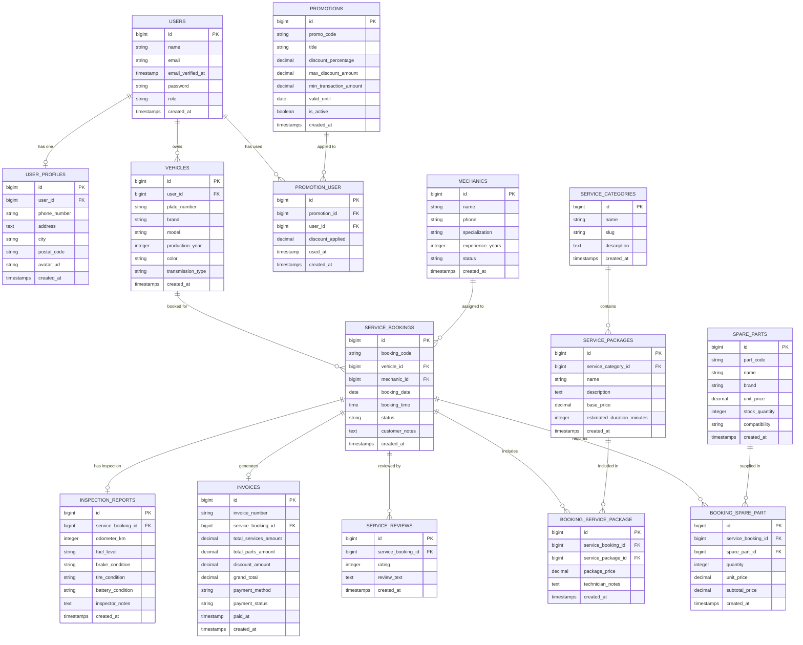

# Entity Relationship Diagram (ERD) - ServiceHub

Sistem Manajemen Bengkel, Booking Servis Kendaraan, Suku Cadang, dan Mekanik.

## 1. Mermaid Diagram

---

## 2. Relasi Antar Tabel (Eloquent Relationships)

### A. One-to-One (1:1)
1. **`User` <-> `UserProfile`**
   - Seorang user memiliki tepat 1 profil data diri lengkap (telepon, alamat, dsb).
   - Relasi: `User::hasOne(UserProfile::class)` dan `UserProfile::belongsTo(User::class)`.
2. **`ServiceBooking` <-> `InspectionReport`**
   - Setiap booking servis memiliki 1 laporan inspeksi awal saat kendaraan tiba di bengkel (odometer, kondisi rem, ban, aki).
   - Relasi: `ServiceBooking::hasOne(InspectionReport::class)` dan `InspectionReport::belongsTo(ServiceBooking::class)`.
3. **`ServiceBooking` <-> `Invoice`**
   - Setiap booking servis menghasilkan 1 tagihan/faktur pembayaran resmi.
   - Relasi: `ServiceBooking::hasOne(Invoice::class)` dan `Invoice::belongsTo(ServiceBooking::class)`.

### B. One-to-Many (1:N)
1. **`User` -> `Vehicle`**
   - Seorang pelanggan bisa mendaftarkan beberapa kendaraan miliknya (mobil/motor).
   - Relasi: `User::hasMany(Vehicle::class)` dan `Vehicle::belongsTo(User::class)`.
2. **`Vehicle` -> `ServiceBooking`**
   - Sebuah kendaraan memiliki riwayat banyak sesi servis dari waktu ke waktu.
   - Relasi: `Vehicle::hasMany(ServiceBooking::class)` dan `ServiceBooking::belongsTo(Vehicle::class)`.
3. **`ServiceCategory` -> `ServicePackage`**
   - Satu kategori servis (misal: Servis Berkala, Kelistrikan, Rem & Kaki-kaki) membawahi beberapa paket servis.
   - Relasi: `ServiceCategory::hasMany(ServicePackage::class)` dan `ServicePackage::belongsTo(ServiceCategory::class)`.
4. **`Mechanic` -> `ServiceBooking`**
   - Satu mekanik dapat ditugaskan untuk menangani banyak pengerjaan booking servis.
   - Relasi: `Mechanic::hasMany(ServiceBooking::class)` dan `Mechanic::belongsTo(Mechanic::class)`.
5. **`ServiceBooking` -> `ServiceReview`**
   - Booking servis memiliki ulasan/feedback dari pelanggan.
   - Relasi: `ServiceBooking::hasMany(ServiceReview::class)` dan `ServiceReview::belongsTo(ServiceBooking::class)`.

### C. Many-to-Many (N:M) dengan Pivot Data
1. **`ServiceBooking` <-> `SparePart` (via `booking_spare_part`)**
   - Dalam satu servis bisa memakai beberapa spare part, dan satu jenis spare part bisa dipakai di banyak booking.
   - Pivot data: `quantity`, `unit_price`, `subtotal_price`.
   - Relasi: `ServiceBooking::belongsToMany(SparePart::class)->withPivot(...)`.
2. **`ServiceBooking` <-> `ServicePackage` (via `booking_service_package`)**
   - Satu booking servis dapat mengambil beberapa paket pengerjaan (misal: Tune-Up + Ganti Oli + Spooring).
   - Pivot data: `package_price`, `technician_notes`.
   - Relasi: `ServiceBooking::belongsToMany(ServicePackage::class)->withPivot(...)`.
3. **`User` <-> `Promotion` (via `promotion_user`)**
   - User dapat mengklaim/menggunakan banyak voucher promo, dan voucher dapat digunakan oleh banyak user.
   - Pivot data: `discount_applied`, `used_at`.
   - Relasi: `User::belongsToMany(Promotion::class)->withPivot(...)`.

### D. Has-Many-Through
1. **`User` -> `ServiceBooking` (through `Vehicle`)**
   - Mengambil seluruh riwayat pemesanan servis seorang user melalui relasi kendaraan yang dimilikinya.
   - Relasi: `User::hasManyThrough(ServiceBooking::class, Vehicle::class)`.
